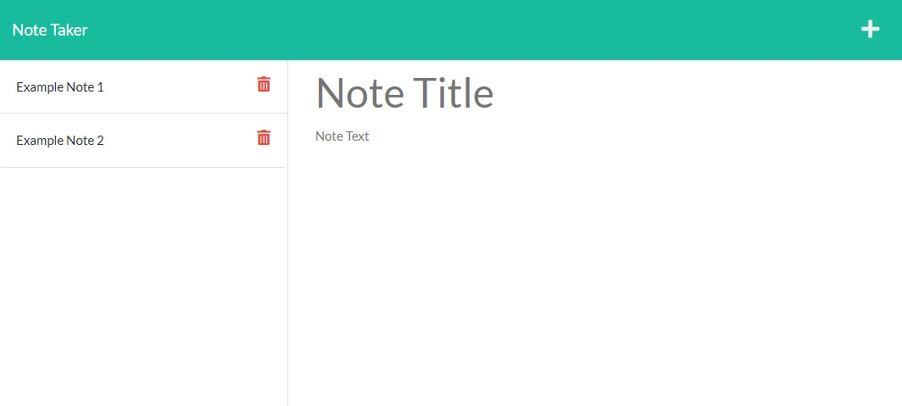

# Note Taker App

  ## Badges
  \
  

  
  
  
  ## Description
  A web app that allows users to input, save, and delete notes. Backend written in express.js.

  
  ## Table of Contents

  - [Usage](#usage)
  - [Contributing](#contributing)
  - [Testing](#testing)
  - [Questions](#questions)
  - [License](#license)
  
  ## Usage
   - Deployed on [Heroku](https://mosnes-note-taker.herokuapp.com/)
   - Click the Heroku link above and click Get Started.
   - Click the Note Title and Note Text areas on the right column to add a title and text.
   - Click the Save icon to save the note.
   - Click the notes listed in the left column to view saved notes.
   - Click the red trash icon to delete a note.

  
  ---
  
  ## Contributing
  
  Feel free to fork and edit this repo for your own experimentation. However, I will not be actively maintaining this app or merging pull requests.
  
  ## Testing
  
  No testing is needed at this time.

  
  ## Questions
  
  If you have any questions regarding this project, please reach out to me here:

  - GitHub: [MosNes](https://github.com/MosNes)
  - Email: 7hekarl@gmail.com

  ## License

    This project is not covered under any license.
